# AI Coding Ticket Pipeline Engineering Implementation Plan (Triple-Loop Closed-Loop Driven Model)

**English** · [简体中文](./engineering-design.zh-CN.md)

This plan is an AI Coding ticket delivery system purpose-built for multi-platform, large-project architectures. The overall architecture is driven by a central scheduler `main_scheduler.py`, invoked on a schedule via Mac's `launchd` service.

This design is based on the **Loop Engineering** philosophy and the **Triple-Loop Model**, decomposing the entire system lifecycle into the **Venture-Discovery Loop**, the **Human-Centric Loop**, and the **Agent-Centric Loop**. Through a set of **triple-loop dynamic interaction protocols** and an **evergreen-docs progressive-disclosure gate**, it achieves an efficient, highly reliable asynchronous coding closed loop.

---

## 1. Core Architecture Design: The Triple-Loop Model

We model the entire system as three sets of nested loops, each driven respectively by "founder exploration," "human engineer design," and "AI Agent implementation." They achieve cross-domain bidirectional communication and state synchronization through physical transitions in the local file system (the `docs/backlog/` and `docs/tickets/` directories under the Git repository).

```mermaid
flowchart TD
    subgraph ventureLoop [1. Venture-Discovery Loop]
        V1["1. Top-Level Design & Business Justification<br>Skill: codoop-discover (in-session)<br><b>Subagents:</b><br>- product-sprint-prioritizer (PM)<br>- sales-offer-lead-gen-strategist (GTM Pricing)<br>- design-ux-architect & design-ui-designer (UI/UX)<br>- engineering-backend-architect & engineering-software-architect (Tech)<br>- alignment-agent (Consistency Auditor)"] -->|"2. Collaborative Drafting"| V2["docs/backlog/design-draft.md<br>(Challenge Loop Conflict Alignment)"]
        V2 -->|"3. Consistency Hard Audit Lock"| V3["Consistency Hard Audit Lock<br>Subagent: workflow-architect"]
        V3 --> V4{"100% Consistency Contract?"}
        V4 -->|"No (Challenge)"| V1
        V4 -->|"Yes [APPROVED]"| V5["4. Formally Solidify Deliverables into Evergreen Docs<br>docs/prd/ & docs/tech/<br>(Auto-prune backlog/)"]
    end

    subgraph humanLoop [2. Human-Centric Loop]
        H1["1. Ticket Draft Initialization<br>docs/tickets/drafts/ticket_ID/"] -->|"2. Business Requirement Design"| H2["2. Pure-Business PRD<br>module_prd.md (Non-technical, No Code)<br>Subagent: product-sprint-prioritizer"]
        H2 -->|"3. Technical Spec Development"| H3["3. Contract Definition (Spec)<br>spec.md (Spec-Driven)<br>Skill: spec-driven-development,<br>api-and-interface-design"]
        H3 -->|"4. Task Planning & Breakdown"| H4["4. Task Breakdown (Plan & Todo)<br>plan.md & todo.md<br>Skill: planning-and-task-breakdown"]
        H4 -->|"5. Finalize, Archive & Release"| H5["5. Relocate to pending/<br>docs/tickets/pending/ticket_ID/"]
    end

    subgraph doubleLoopInteraction [3. Double-Loop Interaction & State Alignment]
        H5 -->|"1. Submitter Finalizes Ticket"| I1["1. Detect Pending Tickets<br>launchd / Scheduled Pipeline Wakeup<br>main_scheduler.py"]
        I1 -->|"2. Process Lock Verification"| I2["2. Exclusive Advisory Lock (fcntl)<br>codoop_flow.lock"]
        I2 -->|"3. Worktree Isolation Initialization"| I3["3. Git Worktree Isolated Dev Zone<br>Clean Clone + Smart Cache Symlink Reconstruction"]
        I3 -->|"4. Local Disclosure"| I4["4. Move to in_progress/ for Isolated Runtime<br>docs/tickets/in_progress/"]
    end

    subgraph agentLoop [4. Agent-Centric Loop]
        I4 -->|"1. Progressive Startup"| A1["1. AI Coding Engine Incremental Development (Build)<br>Progressively disclose spec, modify code in designated directories<br><b>Tools:</b> Claude Code / Codex / Cursor<br>Skill: incremental-implementation"]
        A1 <-->|"2. Read/Write Modifications"| WTCode["Temporary Isolated Worktree"]
        A1 -->|"3. Local Test Sandbox"| A2["2. Adaptive Test Sandbox (Verify)<br>Execute script/test-[module].sh<br>Adaptive headless screenshots (no pixel-size limit)<br>docs/tickets/in_progress/[id]/public/qa-screenshots/<br>Skill: test-driven-development"]
        A2 --> A3{"All Automated Tests Green?"}
        
        A3 -->|"No (Platform Error Denoising)"| A4["3. Instant Self-Healing Correction (Debug)<br>Precise cleaning of stderr/stdout<br>Inject Debug Prompt (max 3 times)<br>Skill: debugging-and-error-recovery"]
        A4 -->|"Iterative Self-Healing"| A1
        A4 -->|"Self-Healing Exhausted"| A8["6. Circuit-Break, Suspend, Move to failed/<br>Generate self-healing failure report healing_report.md"]
        
        A3 -->|"Yes"| A5["4. Parallel Five-Fold Review Gate (Review)<br>Static Evaluation Group (code/security/coverage)<br>Dynamic Screenshot Acceptance Group (UI/UX experience review)<br>Skill: code-review-and-quality, ..."]
        A5 --> A6{"Unanimous APPROVED from All Five?"}
        
        A6 -->|"Reject (Defects Present / Annotated Feedback)"| A4
        A6 -->|"Approve"| A9["5. Optional Persona Experience Walkthrough<br>Read PRD task context, simulate a runnable user flow<br>Write advisory experience_report.md; no auto-fix or ticket creation<br>Skill: codoop-ux-walkthrough"]
        A9 --> A7["6. Auto-Sync Evergreen & Ship (Ship)<br>Subagent: technical-writer (sync PRD/tech)<br>Subagent: git-workflow-master (push code)<br>Move to done/ for archival, force-clean Worktree"]
    end

    V5 -->|"5. Consult evergreen-docs standards<br>Begin manual/assisted ticket breakdown"| H1
    A7 -->|"Handover Feedback"| UserAccept["5. Human Acceptance / One-Click Merge & Launch<br>Skill: shipping-and-launch"]
    UserAccept -.->|"Iterate New Requirements"| H1
    A8 -->|"Manual Fix / Re-submit Ticket"| H1

    %% Style beautification definitions
    style V1 fill:#e1f5fe,stroke:#0288d1,stroke-width:2px,color:#000
    style V2 fill:#e1f5fe,stroke:#0288d1,stroke-width:2px,color:#000
    style V3 fill:#e1f5fe,stroke:#0288d1,stroke-width:2px,color:#000
    style V4 fill:#e1f5fe,stroke:#0288d1,stroke-width:2px,color:#000
    style V5 fill:#e1f5fe,stroke:#0288d1,stroke-width:2px,color:#000

    style H1 fill:#fff3e0,stroke:#f57c00,stroke-width:2px,color:#000
    style H2 fill:#fff3e0,stroke:#f57c00,stroke-width:2px,color:#000
    style H3 fill:#fff3e0,stroke:#f57c00,stroke-width:2px,color:#000
    style H4 fill:#fff3e0,stroke:#f57c00,stroke-width:2px,color:#000
    style H5 fill:#fff3e0,stroke:#f57c00,stroke-width:2px,color:#000

    style I1 fill:#f3e5f5,stroke:#7b1fa2,stroke-width:2px,color:#000
    style I2 fill:#f3e5f5,stroke:#7b1fa2,stroke-width:2px,color:#000
    style I3 fill:#f3e5f5,stroke:#7b1fa2,stroke-width:2px,color:#000
    style I4 fill:#f3e5f5,stroke:#7b1fa2,stroke-width:2px,color:#000

    style A1 fill:#e8f5e9,stroke:#388e3c,stroke-width:2px,color:#000
    style A2 fill:#e8f5e9,stroke:#388e3c,stroke-width:2px,color:#000
    style A3 fill:#e8f5e9,stroke:#388e3c,stroke-width:2px,color:#000
    style A4 fill:#e8f5e9,stroke:#388e3c,stroke-width:2px,color:#000
    style A5 fill:#e8f5e9,stroke:#388e3c,stroke-width:2px,color:#000
    style A6 fill:#e8f5e9,stroke:#388e3c,stroke-width:2px,color:#000
    style A7 fill:#e8f5e9,stroke:#388e3c,stroke-width:2px,color:#000
    style A8 fill:#e8f5e9,stroke:#388e3c,stroke-width:2px,color:#000
    style A9 fill:#e8f5e9,stroke:#388e3c,stroke-width:2px,color:#000
```




---

## 2. Venture-Discovery Loop: Business Exploration and Project Anchoring

This loop runs **before any concrete feature ticket is generated**. It is the core justification stage for the project's "0-to-1" top-level design, business-model design, and technical-architecture blueprint.

**Invocation**: User invokes the `codoop-discover` skill **in-session** within Claude Code, Codex, Cursor, or another AI coding tool:
```
/skill codoop-discover I want to build a SaaS project management tool for remote teams
```

The skill orchestrates Subagents in parallel collaboration to ensure that the project forms scientific, consistent specification assets from the very start, avoiding "tech debt" and "product assumptions." The entire process involves no actual business code or physical scaffolding whatsoever; it focuses solely on the accumulation of documentation assets and the polishing of consensus.

### 2.1 Core Operating Rules of the Discovery Loop and Consistency Audit (The Challenge Loop)

1. **De-Assumption Rigorous Interrogation (SNAP - Strict Non-Assumption Principle)**:
  - The top-level design does not permit any default fantasies for key settings such as multi-platform architecture, database selection, or pricing model.
  - Whenever a Subagent discovers opaque information at any requirement or design node, it must pause and, via a structured Querying protocol (listing Option A / Option B along with their pros-and-cons analysis and recommendation), refer the decision to a human.
2. **Decentralized Multi-Role Collaboration (Decentralized Drafting)**:
  - Joint drafting first takes place in `docs/backlog/design-draft.md`.
  - **Interactive Conflict Challenge Mechanism (Challenge Loop)**:
    - Agents raise objections and provide answers through specific annotated rewrites, such as `[CHALLENGE: UX -> Architect] <description of the conflict between visual interaction and API design>`
    - Once an objection is resolved or the design is modified, it is rewritten as `[RESOLVED: Architect] <description of the final aligned contractual solution>`
3. **Consistency Audit Lock**:
  - Once the draft is polished, the scheduling brain invokes `workflow-architect` to perform a full-domain file consistency audit.
  - After passing the review, `[ALIGNMENT APPROVED: Alignment]` is automatically appended to `design-draft.md`.
  - The product-owner agent (PM) submits `[WAITING FOR HUMAN REVIEW]` to the human. After the human engineer completes the review and signs off, the document is formally solidified into `docs/`.

### 2.2 Core Output Asset Topology

Once the Discovery Loop passes, the entire process is 100% focused on polishing high-quality design and specification documents. It **does not need to generate or run any physical scaffolding or code whatsoever**. It only needs to solidify and accumulate the following 5 dimensions of structured, high-standard documents under the `docs/backlog/` directory.

After the documents are finalized and locked, **the human engineer decides how to break this top-level blueprint down into concrete atomic ticket tasks (placed under `docs/tickets/pending/`)**, then dispatches them to the AI coding pipeline (the Agent-Centric Loop) to be efficiently implemented in the Worktree environment (for example, initializing the scaffolding can be directly issued to the AI engine as the first physical ticket, `ticket_001_project_scaffolding`):

- `**product/` (Product & Business Layer)**:
  - `requirements.md`: The core PRD, containing the global product matrix, state-transition diagrams, and Gherkin BDD scenario definitions.
  - `user-journey.md`: User-journey design and experience-story descriptions.
  - `monetization-plan.md`: Pricing strategy, free-vs-paid tier limit rules, and monetization tracking-point design.
- `**interface/` (Interaction & Visual Layer)**:
  - `design-system.md`: The design system, defining visual tokens for color, spacing, and font size.
  - `ui-mockups.md`: Interactive ASCII text prototypes, wireframes, and animation parameters.
- `**architecture/` (Technical Architecture Layer)**:
  - `architecture.md`: Multi-platform technology selection, high-concurrency strategy, data flow, and caching architecture.
  - `database-schema.sql`: Complete DDL, foreign-key constraints, indexes, and performance-benchmark constraints.
  - `openapi.yaml`: A production-grade service-contract document compliant with the OpenAPI 3.0 specification.
- `**modules/` (Detailed Module Design)**:
  - `module-<name>.md`: For each micro-module's independent per-platform functionality, provides atomic Given-When-Then input test cases.
- `**bridge/` (Human-Machine Bridge Layer)**:
  - `human-preparation.md` (Human Prerequisite Checklist): Lists external non-technical dependencies (such as registering an App Store developer account, applying for the WeChat Pay API, configuring a domain, etc.) to achieve a zero-latency start.
  - `ai-co-dev-guide.md` (AI Co-Development Guide): Guides humans on how to collaborate efficiently with the AI coding engine step by step in subsequent iterations.
  - `scaffolding-blueprint.md` (Scaffolding Blueprint): The physical file topology diagram of the project's multi-platform directories, plus the configuration manifest for compilers and package managers. It is the sole blueprint for automated scaffolding initialization.

### 2.3 Top-Tier Professional Subagent Mapping

The advanced professional roles in the Discovery Loop no longer use simple model configurations; they are comprehensively upgraded and mapped to the high-standard industry experts under `agency-agents-main`:

- **PM (Product Director)**: Uses `./source/agency-agents-main/product/product-sprint-prioritizer.md` as the overall product-strategy lead.
- **GTM & Pricing (Business Strategy / Pricing Expert)**: Uses `./source/agency-agents-main/sales/sales-offer-lead-gen-strategist.md` or `sales-deal-strategist.md`, responsible for polishing the business plan (GTM) and paid boundaries.
- **UX & UI Designer (Interaction Experience & Visual Expert)**: Uses `./source/agency-agents-main/design/design-ux-architect.md` & `design-ui-designer.md` jointly to complete the user-journey definition and ASCII UI prototype sketches.
- **System Architect (Chief Architect)**: Uses `./source/agency-agents-main/engineering/engineering-backend-architect.md` & `engineering-software-architect.md` to conduct technical-architecture red-team testing and produce the database, OpenAPI contract, and the `scaffolding-blueprint.md` physical directory-topology design (pure documentation specifications), without writing any actual code.

---

## 3. Global Project Directory Structure Design

To support multi-platform development while ensuring the technical documentation (the single source of truth) is tightly aligned with the codebase, the following unified workspace directory is designed:

```bash
codoop-project-repo/            # Main project Git repo (Single Source of Truth + core code)
├── docs/                       # Knowledge base & the project's Single Source of Truth
│   ├── backlog/                # Early-stage exploration directory (documents produced by the Venture-Discovery Loop)
│   │   ├── design-draft.md     # Jointly drafted design draft (Challenge Loop collaborative debate zone)
│   │   ├── alignment-report.md # Consistency audit report
│   │   ├── product/            # Product & business layer (requirements.md, user-journey.md, monetization-plan.md)
│   │   ├── interface/          # Interaction & visual layer (design-system.md, ui-mockups.md)
│   │   ├── architecture/       # Technical architecture layer (architecture.md, database-schema.sql, openapi.yaml)
│   │   ├── modules/            # Detailed module design (module-<name>.md)
│   │   └── bridge/             # Human-machine bridge layer (human-preparation.md, ai-co-dev-guide.md, scaffolding-blueprint.md)
│   ├── tickets/                # Unified ticket-lifecycle directory (Single Source of Truth; humans submit tickets here)
│   │   ├── drafts/             # Ticket-submission design draft zone (humans design tickets here, containing PRD/Spec/Plan/Todo draft files)
│   │   │   └── ticket_001/     # Draft ticket directory
│   │   │       ├── metadata.json # Ticket configuration (declares involved modules, test commands, designated AI coding engine [claude/codex/cursor], etc.)
│   │   │       ├── module_prd.md # Pure-business PRD (100% pure business, no technology, no code whatsoever)
│   │   │       ├── spec.md       # Technical spec & contract (follows spec-driven development, API contract + UI interaction spec)
│   │   │       ├── plan.md       # Execution step plan (produced by planning-and-task-breakdown)
│   │   │       └── todo.md       # Atomic checkbox task list (with module prefixes)
│   │   ├── pending/            # Cross-platform pending-development ticket zone (after finalization, the ticket folder is relocated here from drafts/ manually or automatically by a Skill, triggering the scheduler)
│   │   │   └── ticket_001/     # Ticket awaiting execution
│   │   ├── in_progress/        # In-progress tickets (moved in by the scheduler, which starts a temporary Worktree)
│   │   ├── done/               # Tickets that have been successfully committed, pushed, and archived
│   │   └── failed/             # Tickets suspended due to repair failure or exceeding limits
│   ├── prd/                    # Business-side evergreen docs (Living PRDs); product-level, long-term business, global PRD document archive
│   └── tech/                   # Technical-side evergreen docs (Living Technical SSoT)
│       ├── project-structure.md # Project directory map and file topology spec
│       ├── changelog.md         # Technical-side atomic changelog (dashboard for major architectural changes)
│       └── tech-standards.md   # Cross-platform technology selection, architecture conventions, and component specs
├── backend/                    # Server-side core code directory (manages its own dependencies internally)
├── web/                        # Web front-end code directory (manages its own dependencies internally)
├── desktop/                    # PC/desktop-side code directory (manages its own dependencies internally)
├── mobile/                     # Mobile-side code directory (manages its own dependencies internally)
├── script/                     # Project automation & test-sandbox script directory (custom-implemented per platform)
└── .gitignore                  # Git ignore configuration
```

---

## 4. Human-Centric Loop

This loop is entirely led and driven by the **human engineer (or product manager)** and forms a rigorous closed loop under the project's Single Source of Truth, `docs/`. Its core goal is to ensure "high determinacy of input requirements and technical contracts."

To guarantee high-standard requirement scoping, agile management, and code planning, the entire ticket-design system follows the scientific process of **"draft staging, step-by-step progressive evolution, and final finalized release."** Humans can spin up a dedicated **Product Agent (product-collaboration expert)** for deep co-creation.

### 4.1 Ticket Evolution Lifecycle Process

1. **Ticket Draft Initialization (Draft Prep)**:
  - **Behavior**: When a human or collaborating Agent decides to add a feature or iterate, they first create a brand-new draft folder named after the ticket ID (such as `ticket_001/`) under the `**docs/tickets/drafts/`** directory.
  - **Purpose**: To isolate ideas that are still being designed, incomplete, or frequently changing in the draft zone, preventing unfinalized tickets from being mistakenly picked up and executed by the scheduler.
2. **Pure-Business Requirement Design (PRD Authoring)**:
  - **Behavior**: Author `**module_prd.md`** in the draft folder.
  - **Human-Machine Collaboration & Subagent Mapping**: The human engineer can invoke the product-strategy expert `product-sprint-prioritizer` (PM) from `./source/agency-agents-main/product/product-sprint-prioritizer.md` at any time. This Agent uses the **RICE / Kano / MoSCoW priority matrices** to trim unrealistic requirement fantasies.
  - **Core Constraint (100% Pure-Business Attribute)**: The generated `module_prd.md` must be a **purely business description and non-technical document**. It focuses entirely on the core business big picture, core business logic, User Stories, business-flow state diagrams, and the Definition of Done (acceptance criteria); it involves no database table structures, interface API fields, or code details whatsoever.
3. **Technical Specification Authoring (Spec Definition)**:
  - **Behavior**: Based on the `module_prd.md` completed in the previous step, design and produce `**spec.md`** (the technical specification) specifically on top of it.
  - **Spec & Skill Compliance**: Follows the `**spec-driven-development`** and `**api-and-interface-design`** specification protocols.
  - **Hard Technical Constraint Definition**: The engineer (or an assisting architecture Subagent) uniformly defines in `spec.md` the multi-platform interface formats involved in this ticket, the API data Schema, technical architecture details, contract specifications, UI interaction conventions, and public state machines.
4. **Atomic Task Breakdown Design (Plan & Todo Authoring)**:
  - **Behavior**: Based on the established `spec.md` technical contract, plan the concrete cross-platform execution steps and produce `**plan.md`** and the atomic task list `**todo.md**`.
  - **Spec & Skill Compliance**: Follows the `**planning-and-task-breakdown`** specification.
  - **Extremely Fine-Grained Breakdown**:
    - `plan.md` explicitly declares the modification steps (e.g., Step 1: first modify the server-side data layer, Step 2: then modify the front-end UI).
    - `todo.md` finely decomposes the steps into an atomic checkbox `- [ ]` list where each item is independently verifiable and **recommended not to exceed 100 lines of code per single modification**. Each checkbox must carry a clear platform prefix, such as `[backend]`, `[web]`, etc., so the AI coding engine can follow the map step by step.
5. **Finalize, Archive & Ticket Release (Promote to Pending)**:
  - **Behavior**: Once `module_prd.md`, `spec.md`, `plan.md`, `todo.md`, and `metadata.json` are all authored and confirmed through human review (or the collaborating Agent sets the status to `FINALIZED`), the entire ticket folder is **cut/moved from `docs/tickets/drafts/` to `docs/tickets/pending/`** via a local light-weight CLI tool, a Skill automation script, or manually.
  - **Wakeup**: A ticket entering the `pending/` zone is considered formally finalized and released. On the next Mac `launchd` or scheduled task wakeup, `main_scheduler.py` automatically extracts the ticket into the development execution loop.
6. **Acceptance, Launch & Evergreen Accumulation (Launch & ADR)**:
  - **Spec & Skill Compliance**: Follows the `**shipping-and-launch`** and `**documentation-and-adrs**` specifications.
  - **Behavior**: After the Agent passes all-green tests and multi-dimensional review in the background Worktree, and the ticket is automatically migrated to `docs/tickets/done/` with the branch pushed, the human engineer confirms correctness in the sandbox test, merges to production with one click, and accumulates new architectural-change records (such as ADR entries) in the global technical evergreen docs.

---

## 5. Agent-Centric Loop

This loop runs entirely within an **isolated local temporary work tree (Git Worktree)**. The scheduling brain dynamically spins up a **mainstream AI coding engine (Claude Code CLI, Codex APIs, or Cursor CLI)** based on the ticket configuration, and operates in a closed loop alongside five specialized Subagents to ensure "high quality, security, and determinacy of the multi-platform experience of the output code":

1. **Multi-Engine / Plugin-Style Progressive Coding Stage (Build)**:
  - **Spec Compliance**: Follows `incremental-implementation` and `context-engineering`.
  - **Engine Abstraction & Dynamic Scheduling**: The scheduler `main_scheduler.py` internally designs a universal **AI Coding Engine abstract interface**. The ticket's `metadata.json` can declare `"coding_engine"` (supporting `claude`, `codex`, `cursor`; if unspecified, the global default is used).
  - **Mainstream Coding Tool Adaptation Logic**:
    - **Claude Code CLI**: Invoked in non-interactive Headless mode via `claude -p [task_prompt]`. Through `--append-system-prompt-file`, it dynamically injects `./skills/incremental-implementation/SKILL.md`, restricting it to modify only the designated platform's code directory.
    - **Codex CLI / API-Driven**:
      - **Codex CLI (OpenAI Official Client)**: Since OpenAI provides Codex with a native client binary and an NPM wrapper (install: `npm install -g @openai/codex`), the scheduler can quickly invoke it via the non-interactive silent mode `codex -q "[task_prompt]"`, or perform highly cohesive, process-unaware, low-level native API control and code modifications via the official `codex-python` SDK on PyPI (`from codex import Codex`).
      - **API Custom-Driven (Generic LLM)**: Directly calls the OpenAI Codex/GPT-5/Claude API, compiling `SKILL.md`, `module_prd.md`, and `spec.md` into a high-density System Prompt and Context, and performs precise modifications to files within the isolated Worktree via an AST (Abstract Syntax Tree) or Search-Replace Blocks.
    - **Cursor CLI / Composer**: Activates Cursor's background command line or background agent in the Worktree directory, loading a preset `.cursorrules` (dynamically containing the relevant Skill specifications) so it can automatically identify and refactor the designated subsystem's code step by step.
  - **Extreme Progressive Disclosure & Technical-Standard Alignment**: Regardless of the coding engine used, at startup the scheduler—besides disclosing the ticket directory's `module_prd.md` and `spec.md`—also dynamically discloses `docs/tech/project-structure.md` and `docs/tech/tech-standards.md` as the technical boundaries and architecture standards it must comply with. This strictly prevents code from breaking the project's overall conventions and incurring tech debt, while also preventing context bloat and scope creep.
2. **Automated Sandbox Verification & Visual Capture Stage (Verify)**:
  - **Spec Compliance**: Follows `test-driven-development`.
  - **Adaptive Multi-Platform Testing & Toolchain Mapping**: Based on the platform subsystems declared in the current ticket's `metadata.json`, the scheduling system adaptively runs the specific automated tests:
    - Runs the unit or integration test script corresponding to the modified module, `bash script/test-[module].sh`. The script must have sandbox-isolation capability (such as using a lightweight isolated database, a virtual sandbox environment, etc.) to avoid producing any dirty-data pollution.
    - **Adaptive UI/UX Visual Capture**: When the ticket modification involves the front end, user interface, or UI interaction, the test script must automatically spin up the corresponding capture and rendering tools:
      - **Web**: Directly spins up headless browsers such as **Playwright / Cypress / Puppeteer** to complete functional assertions and visual screenshots locally.
      - **Mobile**: Automatically spins up the corresponding iOS / Android **physical Simulator/Emulator or Appium automation test agent** to drive interactions and capture states.
      - **Desktop / PC Client**: According to the specific client UI framework and system architecture chosen for the project, spins up the specific client's automation test agent (e.g., an Electron project can directly use Playwright, while a C# / QT project spins up the corresponding platform's automation driver) for capture.
    - **Capture Requirements (Cohesive Isolation Within the Worktree's Local Path)**: All test assets, screenshots, and reports are **strictly forbidden from being output to any global public path**. All screenshots adaptively use the actual runtime resolution, with **no forced hard constraint on image pixel size whatsoever**, allowing them to render naturally. Test reports and captured screenshots must be forcibly output to the current ticket directory within the current temporary Worktree, i.e., `docs/tickets/in_progress/[ticket_id]/public/qa-screenshots/`:
  1. **Adaptive Multi-Platform Resolution Screenshots**: Output page visual-rendering screenshots such as `responsive-desktop.png`, `responsive-tablet.png`, `responsive-mobile.png`, adaptive to the current runtime terminal.
  2. **Dynamic Interaction State Sequence Diagrams**: For form validation, complex modals, or multi-step navigation interactions, output operation comparison sequences (e.g., `form-empty.png` (empty form) vs `form-filled.png` (filled form); `nav-before-click.png` vs `nav-after-click.png`).
    Result Collection**: Uniformly generate `docs/tickets/in_progress/[ticket_id]/public/qa-screenshots/test-results.json` under the ticket directory, aggregating all device compatibility, interaction states, and test-case pass status. When loading, the review Subagents (such as `evidence-collector`) will also only read this local isolated path, ensuring data purity.
     Skill Loading**: When starting tests and adding new test cases, the scheduler appends and mounts the content of `./skills/test-driven-development/SKILL.md`, forcing the current AI coding engine to strictly cover the Happy Path, empty/null boundaries, and exception branches when modifying code.
3. **System-Level Correction & Per-Platform Self-Healing Stage (Debug)**:
  - **Spec Compliance**: Follows the triage mechanism of `debugging-and-error-recovery`.
  - **Instant Feedback Self-Healing**: If the automated unit/integration tests on any of the above platforms fail to run, or screenshot collection is abnormal, the pipeline immediately triggers the **Stop-the-line** circuit-breaker mechanism.
    - **Intelligent Denoising & Refinement**: The scheduler spins up a lightweight denoising model to precisely clean the raw errors, compilation stacks, and test-assertion exceptions from the various per-platform test frameworks, extracting the most core **Traceback, error code line numbers, and Exception details**, and avoiding irrelevant build-log noise.
    - **Instant Feedback Injection**: These cleaned structured errors and the corresponding platform environment context are reshaped into a high-density Debug Prompt (with the triage rules of `./skills/debugging-and-error-recovery/SKILL.md` prepended at the top) and passed directly back to the currently executing AI coding engine to initiate self-healing.
    - **Maximum Attempt Limit**: Self-healing requests are limited to a maximum of 3 times. If the retries are exhausted and it still does not pass, the run is terminated, circuit-breaker protection is applied, the ticket is moved to the `failed/` directory, and a `healing_report.md` containing all error details is output.
4. **Parallel Five-Fold Multi-Dimensional Review Gate Stage (Review)**:
  - **Spec Compliance**: Follows `code-review-and-quality`, `security-and-hardening`, and the `./source/agency-agents-main/testing/` specifications.
  - **Logic**: After the multi-platform tests all pass green and the local Worktree screenshot assets and test reports are fully generated, the scheduler spins up five specialized Persona review sub-processes in parallel, applying an extremely rigorous **five-fold dimensional combined dynamic-and-static review** to the `git diff` source code under the Worktree directory and the screenshot files under the local ticket directory (located at `docs/tickets/in_progress/[ticket_id]/public/qa-screenshots/`).
  - **Dynamic Subagent Gate Loading**: The scheduler reads the corresponding markdown role definitions respectively and injects them as the System Prompt into concurrent LLM API calls:
    - **Static Code Review Group**:
      - `**code-reviewer`**: Dynamically reads `agents/code-reviewer.md`, follows a five-axis assessment of Correctness, Readability, Architecture, Security, Performance, analyzes the `git diff`, and gives a Critical/Important issue classification.
      - `**security-auditor**`: Dynamically reads `agents/security-auditor.md`, deeply auditing OWASP vulnerabilities and sensitive token/secret-key leaks.
      - `**test-engineer**`: Dynamically reads `agents/test-engineer.md`, verifying test-coverage blind spots, empty/null boundaries, and test-case robustness.
    - **Dynamic UI/UX Experience Acceptance Group**:
      - `**evidence-collector`** (UI Visual Spec Acceptance): Dynamically reads `./source/agency-agents-main/testing/testing-evidence-collector.md`. This agent is a screenshot-obsessed perfectionist that refuses any proof without images. It reads the `responsive-*.png` (adaptive multi-resolution screenshots) and interface interaction screenshots under the local isolated directory, strictly checking whether they conform to the visual Tokens, Spacing, responsive rendering, etc., defined in `spec.md`, and by default seeks out 3-5 layout or visual-detail defects.
      - `**reality-checker**` (UX Interaction Experience / Flow Verification): Dynamically reads `./source/agency-agents-main/testing/testing-reality-checker.md`. This agent is completely immune to PowerPoint/fantasy-style reporting, with its default state set to `NEEDS WORK`. It pulls up before-and-after interaction comparison screenshots to verify the complete interaction flow (such as whether the navigation menu pops up smoothly, whether form-validation errors are displayed, whether modals obstruct content, etc.), evaluating the actual E2E interaction experience.
    - **Merge Gateway (Merge Step)**: All five parties must unanimously `APPROVED`. If any party gives a Critical/Important-level defect (or `evidence-collector` finds a broken layout, or `reality-checker` determines there is an interaction obstruction), it is REJECTED. All review and visual annotation feedback is merged into `review_comments.md`, along with the fault screenshot path information, and returned to the currently running AI coding engine for self-healing repair.

---

### 5.4 Optional Persona Experience Walkthrough (Advisory)

After technical approval, a runnable user-facing ticket may invoke
`codoop-ux-walkthrough`. It provides the ticket's PRD role, goal, scope, and
acceptance criteria as task context to an independently selected persona and
writes `experience_report.md` inside the ticket directory. This is a qualitative
product insight for human review only: it does not block release, trigger
self-healing, modify code, or create a new ticket.

---

## 6. Triple-Loop Interaction and State Synchronization

There is no direct human-machine blocking interruption between the three loops; they dynamically align through a set of **"bidirectional interaction protocols" based on a file-system state machine**, ensuring the pipeline is fully automated and conflict-free:

1. **Project Solidification & Unidirectional Evolution Protocol (Venture -> Human-Centric)**:
  - **Spec Solidification**: After the top-level design and Consistency Audit Lock are APPROVED, the 5 dimensions of baseline exploration documents are solidified into `docs/backlog/` (the incubation staging area).
  - **SSoT Unidirectional Evolution & Pruning**: When a human reviews the Backlog and decides to begin breaking down tickets, the **first step** must be to formally merge/copy the core PRD business descriptions, Spec interface contracts, visual Tokens, etc., that passed the consistency audit in `docs/backlog/` into the trunk evergreen-docs directories (`docs/prd/` and `docs/tech/`) for archival.
  - **Archival Pruning**: Once the evergreen docs are updated and locked, the corresponding version's `docs/backlog/` incubation subdirectory is automatically pruned and archived (or cleared), ensuring that throughout the entire development cycle the system has only the trunk `docs/prd/` and `docs/tech/` as the **sole, version-conflict-free Single Source of Truth (SSoT)**.
  - **Ticket Dispatch**: Based on the latest specification standards merged into the evergreen-docs trunk, the human engineer creates concrete incremental feature tickets under `docs/tickets/pending/` (for example, initializing the scaffolding can be directly used as the first physical ticket `ticket_001_project_scaffolding`), starting the lifecycle development loop.
2. **Ticket Submission Protocol (Human -> Agent)**:
  The human engineer completes the PRD, Spec, Plan, and Todo in the local workspace. With one click, the ticket folder is cut and placed into `docs/tickets/pending/`.
3. **Trigger, Exclusive Lock & Isolation Protocol (System-level Initialization & Lock-Worktree Engine)**:
  Mac `launchd` or a pipeline service (such as scheduled or triggered) invokes `main_scheduler.py`.
  - **Flexible Task Concurrency Model**: To meet the engineering-efficiency needs of different teams, the scheduling architecture designs the following two concurrency-control schemes, entirely configurable by the user according to their own project and runtime environment:
    - **1) Default Single-Agent Serial Execution**: Under the default configuration, the system starts only one running instance. The scheduler uses a **global file advisory lock** to ensure that only one ticket task is in the development-and-self-healing state at any given time. This is the safest, most lightweight mode, least likely to cause contention for local build resources.
    - **2) Advanced: Multi-Agent Parallel Execution**: If the user decides to execute multiple tickets concurrently, **the isolation mechanism provided by Git Worktree perfectly ensures concurrency safety**. Since each ticket has a completely independent cloned work tree (100% independent disk directory, code state, and test sandbox), different AI coding engines can concurrently modify and build their respective tickets. In parallel mode, the system lock automatically descends to a **ticket-level local advisory lock** (such as `ticket_[id].lock`), allowing different workspaces to truly and safely run concurrently in the background.
  - **Process Advisory Lock (fcntl.flock) Self-Healing Mechanism (solving the stale-lock problem)**:
    - To prevent deadlock problems caused by a stale physical lock file left behind due to a process being force-killed, a system power outage, or an OOM, the scheduler `main_scheduler.py` must use a system-level **Advisory File Lock**. Depending on the user's concurrency configuration, it can bind the lock to a process/file descriptor (FD) on either the global lock file or the local ticket lock file:
      ```python
      import fcntl, sys
      try:
          # Depending on the user's concurrency config, use the global lock codoop_flow.lock or the local lock ticket_[id].lock
          lock_file = open('codoop_flow.lock', 'w')
          fcntl.flock(lock_file, fcntl.LOCK_EX | fcntl.LOCK_NB) # Exclusive non-blocking lock
      except IOError:
          # The lock is already held by another instance, indicating the current task or the overall schedule is running; this process exits safely
          sys.exit(0)
      ```
      *Advantage*: Because this system advisory lock is directly bound to the lifecycle of the Python process, once the process exits abnormally or the machine restarts, the OS kernel automatically releases the lock-file handle, perfectly achieving "deadlock self-healing" with zero manual intervention.
  - **Exclusive Extraction & File Relocation**: Detect whether an in-progress ticket exists in `docs/tickets/in_progress/`. In serial mode, if it is not empty, skip; if the concurrency extraction rules are met, scan `pending/` to obtain the oldest ticket, atomically move it to `in_progress/`, and lock that ticket.
  - **Git Worktree Fault-Tolerance & Reuse Mechanism (supporting ticket retries)**:
    - Before preparing to create a new Worktree each time, the scheduler must first execute `git worktree prune` to forcibly clear stale work-tree references left behind internally by Git.
    - The scheduler detects whether the branch `dev/[ticket_id]` already exists locally:
      - **Branch Already Exists (ticket-retry scenario)**: Directly use `git worktree add ~/codoop_tickets/worktrees/[ticket_id] dev/[ticket_id]` to associate the workspace with the existing branch, and immediately execute `git reset --hard HEAD` in the Worktree directory to ensure the work environment is thoroughly clean, clearing residue from the previous failure, then proceed with development.
      - **Branch Does Not Exist (first-development scenario)**: Use `git worktree add -b dev/[ticket_id] ~/codoop_tickets/worktrees/[ticket_id]` to create a brand-new branch and isolated work tree.
  - **Universal Dependency Configuration & Compilation Cache Sharing Scheme**:
  To achieve second-level environment initialization without disturbing foreground human development, while avoiding dependency-resolution defects across different languages and compilation systems, a **categorized shared-dependency-and-cache strategy** is adopted, configured autonomously by the user according to the specific dependency package manager and compiler characteristics used. The scheduling system provides support for the following abstract mechanisms:
    - **Type A (environments compatible with and supporting symlinks / soft links)**: For dependency environments that fully support and can smoothly traverse symlinks when moving or copying paths (such as some pure scripting languages and front-end bundling systems), when initializing the Worktree directory the scheduler directly mounts the physical dependency folders under the trunk directory into the work tree via second-level symlinks. The user only needs to enable the symlink-tracking preservation option in the corresponding build or run configuration (such as `preserveSymlinks`) so the compilation phase can safely traverse the symlink to read the actual physical files.
    - **Type B (environments incompatible with or not recommending symlinks)**: For some native compilers and certain build tools that hard-code compile-time relative paths—because they do not support symlinks or would trigger fatal relative-path-resolution errors—**the system strictly forbids direct relative-path symlinking of physical dependency directories**. Such environments uniformly adopt a **host-machine global shared Store/Cache mechanism** configured autonomously by the user (for example, configuring that language's package manager's global read-only shared cache, or leveraging the compiler's own global central compilation-cache directory). This both guarantees second-level readiness of the Worktree with zero disk copying, and completely avoids resolution failures and compilation interruptions caused by changed relative paths.
4. **Task State Synchronization Protocol (Bidirectional Alignment)**:
  - **In-Progress State**: While the current AI coding engine works in the isolated environment, each time it completes a `todo.md` checkbox, the scheduler automatically rewrites that item to `[x]` in the corresponding ticket's `todo.md` under `in_progress/`, and dynamically updates the Step indicator in `plan.md`, achieving real-time landing of progress.
5. **Ticket Handover & Archival Protocol (Agent -> Human)**:
  - **Evergreen-Docs Sync & Successful Ticket Transition**: After the tests and parallel Review are all green, the Git Agent starts:
  1. **Fully Automated Evergreen-Docs Sync**: The scheduler spins up a dedicated `technical-writer` agent (reading the role spec `./source/agency-agents-main/engineering/engineering-technical-writer.md`), which fully automatically extracts this ticket's `git diff`, `todo.md`, and the changed core API/module rules:
    - Automatically updates the corresponding core business-module logic under the business evergreen doc `docs/prd/`;
    - Automatically redraws and updates the architecture topology in the technical evergreen doc `docs/tech/project-structure.md`;
    - Automatically distills a high-density architecture and technology-evolution log and appends it to `docs/tech/changelog.md`.
  2. **Standardized Commit & Cleanup**: Invokes the `git-workflow-master` agent (reading `./source/agency-agents-main/engineering/engineering-git-workflow-master.md`) for conflict inspection, commits all code and technical/business documentation changes in the isolated Worktree with standardized Conventional Commits (such as `docs(tech/prd): sync living documentation for ticket_001`), and pushes the branch directly to the remote. Then, the scheduler executes `git worktree remove --force` to completely wipe the temporary work tree, and transfers the ticket folder from `in_progress/` to the `done/` directory for archival.
    Ticket Failure Interruption & Self-Healing**: If self-healing fails or the test retries are exhausted, the pipeline stops. The scheduler moves the ticket folder into `failed/`, writes `healing_report.md` with the recovery worktree path and branch, releases the lease, and retains the worktree with its uncommitted changes. The human submitter can open that recorded worktree to intervene and repair precisely.

---

## 7. In-Depth Skill and Subagent Mapping Table for Each Stage of the Ticket Pipeline

To fully engineer the `agent-skills` specifications into production, the lifecycle stages, execution tools, and Skill mapping details for the entire pipeline are as follows:


| Pipeline Phase (Phase)                | Mapped `agent-skills` Skill                                                                  | Executor / Role (Subagent / Executor)                                                                                                                                                                                                                                                                                               | Specific Control Behaviors & Rule Compliance (Behavior & Control Rules)                                                                                                                                                                                                                                                              |
| ---------------------------- | ----------------------------------------------------------------------------------------- | ----------------------------------------------------------------------------------------------------------------------------------------------------------------------------------------------------------------------------------------------------------------------------------------------------------------------------------- | ---------------------------------------------------------------------------------------------------------------------------------------------------------------------------------------------------------------------------------------------------------------------------------------------------- |
| **1. Top-Level Business & Architecture Justification (Discovery)** | `product-discovery-loop`                                                                  | **Product Discovery Subagents** (top-tier expert roles loaded by the main brain from `source/agency-agents-main/`: `product-sprint-prioritizer` (product), `sales-offer-lead-gen-strategist` (GTM and pricing), `design-ux-architect` & `design-ui-designer` (UX and UI design), `engineering-backend-architect` & `engineering-software-architect` (technical architecture), `workflow-architect` (consistency hard-lock audit)) | 1. **Full-Chain Justification**: The PM, business-strategy expert, UI/UX design experts, and chief technical architect conduct 0-to-1 de-assumption top-level justification, polishing the 5 dimensions of specification drafts in `docs/backlog/`. 2. **Audit Lock**: After `workflow-architect` performs a 100% consistency audit of the drafts, they are solidified, merged into the evergreen docs, and the backlog Staging area is cleared.                                                                                                                   |
| **2. Requirement Design Definition (Define)**       | `spec-driven-development` `api-and-interface-design`                                      | **Human Submitter-Led + Product Agent Collaboration** (reads the product-director role in `source/agency-agents-main/product/product-sprint-prioritizer.md`)                                                                                                                                                                                                                | 1. **Pure-Business PRD (module_prd.md)**: The human, collaborating with the PM, writes a purely business description document—100% pure-business attribute, absolutely no code or database details. 2. **Spec-Driven Spec (spec.md)**: Following the `spec-driven-development` spec-driven-development principles, authors the technical specification (spec.md) targeting the business PRD, declaring the API contract and UI interaction guidelines, establishing rigid hard-constraint boundaries for development.                                                                        |
| **3. Task Planning & Breakdown (Plan)**         | `planning-and-task-breakdown`                                                             | **Human Submitter-Led / Assisting Breakdown Model**                                                                                                                                                                                                                                                                                                          | 1. **Step Planning (plan.md)**: Based on the `spec.md` contract, use plan.md to specify the multi-platform collaboration or step-by-step development path. 2. **Atomic Tasks (todo.md)**: Use `planning-and-task-breakdown` to refine the Plan into an atomic checkbox `- [ ]` list where each single modification does not exceed 100 lines of code. Each must carry a clear subsystem-module prefix such as `[backend]`, `[web]`, `[desktop]`, `[mobile]`, etc. After design is complete, migrate from `drafts/` to `pending/` to wake the scheduler.                        |
| **4. Isolated Progressive Development (Build)**        | `incremental-implementation` `context-engineering`                                        | **Abstract AI Coding Engine** (supports only Claude Code CLI, Codex CLI/API, Cursor CLI)                                                                                                                                                                                                                                                               | 1. **Progressive Disclosure**: When the scheduler starts the coding engine, it discloses only the `module_prd.md` and `spec.md` within that ticket's local work tree, preventing context bloat and large-scope modifications. 2. **Edit Sandbox Restriction**: At the System Prompt level, strongly constrains the coding tool to edit only the file whitelist restricted by the spec (such as within `backend/`), ensuring scope discipline.                                                                                                                                   |
| **5. Automated Verification & Visual Capture (Verify)**   | `test-driven-development`                                                                 | **Per-Platform Test Executor** (`script/test-[module].sh`) + **Adaptive Multi-Platform Automated Test & Capture Agent Tools**                                                                                                                                                                                                                               | 1. **Sandbox Functional Verification**: Automated unit and integration tests all run green. 2. **Adaptive UI/UX Visual Capture**: The system intelligently matches test tools according to the ticket's subsystem (Web spins up Playwright, Mobile spins up a simulator/Appium, PC desktop spins up the corresponding driver depending on the architecture). 3. **Local Path Isolation**: Screenshots have no restriction on image resolution size, no hard dark-mode-screenshot requirement, and are forcibly saved in the local isolated path, completely avoiding conflicts.                                                                                                       |
| **6. Per-Platform Instant Feedback Self-Healing (Debug)**      | `debugging-and-error-recovery`                                                            | **Scheduler Denoising Model** + **Abstract AI Coding Engine**                                                                                                                                                                                                                                                                                                  | 1. **Intelligent Error Cleaning**: Extracts and denoises the raw errors or compilation stacks of various test frameworks, filters out log noise, and distills high-value Exception details. 2. **Instant Feedback Loop**: After reshaping into a high-density structured Debug Prompt, immediately injects it into the current coding engine, initiating a maximum of 3 isolated self-healing attempts.                                                                                                                                       |
| **7. Multi-Dimensional Parallel Review Gate (Review)**     | `code-review-and-quality` `security-and-hardening` `evidence-collector` `reality-checker` | **Five Parallel Subagents (parallel fan-out)**: 1. `code-reviewer` (five-axis code) 2. `security-auditor` (OWASP security) 3. `test-engineer` (unit & coverage) 4. `evidence-collector` (UI visual acceptance) 5. `reality-checker` (UX interaction experience)                                                                                                                                        | 1. **Static + Dynamic Combined Review Gate**: Spins up 5 independent expert Agents in parallel; the static group reviews the `git diff` source code, and the dynamic group conducts extremely rigorous review and acceptance of UI fidelity and UX experience flow via `responsive-*.png` and interaction comparison screenshots. 2. **One-Vote Veto**: A rejection from any party (such as finding severe visual misalignment or interaction obstruction) triggers `REJECT`, merging the defect feedback and returning it for self-healing repair.                                                                                                               |
| **8. Automated Commit & Release (Ship)**         | `git-workflow-and-versioning` `documentation-and-adrs`                                    | **Technical Writer** + **Git Workflow Master** (Subagent roles loaded by the main process)                                                                                                                                                                                                                                                          | 1. **Automatic Evergreen-Docs Alignment**: Uses `technical-writer` to extract the `git diff` and automatically update the core business logic in `docs/prd/`, redraw and refresh the architecture topology tree in `docs/tech/project-structure.md`, and append the changelog to `docs/tech/changelog.md`. 2. **Conventional Commits Commit**: `git-workflow-master` automatically generates a Conventional Commit Message based on the `git diff` containing code and docs and pushes the branch, then forcibly cleans up and releases the Worktree. |
