# AI Coding 工单流水线工程化落地方案 (三环闭环驱动模型)

[English](./engineering-design.md) · **简体中文**

本方案是专为多端大项目架构设计的 AI Coding 工单落地系统。整体架构由一个中央调度器 `main_scheduler.py` 驱动，定时通过 Mac 的 `launchd` 服务调起。

本设计基于 **Loop Engineering (循环工程)** 思想与 **三环模型 (The Triple-Loop Model)**，将整个系统的生命周期拆解为 **创业探索环 (Venture-Discovery Loop)**、**以人为中心的需求设计环 (Human-Centric Loop)** 与 **以 Agent 为中心的自愈实现环 (Agent-Centric Loop)**，并通过一套**三环动态交互协议**与**常青树文档渐进式披露门禁**实现高效、高可靠的异步编码闭环。

---

## 1. 核心架构设计：三环模型 (The Triple-Loop Model)

我们将整个系统建模为由“创业者探索”、“人类工程师设计”与“AI Agent 实现”各自驱动的三套嵌套循环。它们通过在本地文件系统（Git 仓库下的 `docs/backlog/` 与 `docs/tickets/`）中的物理流转进行跨领域的双向通信与状态同步。

```mermaid
flowchart TD
    subgraph ventureLoop ["1. 创业探索环 - Venture-Discovery Loop"]
        V1["顶层设计与商业论证
        Skill: codoop-discover (会话内调用)
        Subagents: PM / GTM / UI-UX / 技术架构 / 一致性审计"] -->|协同草拟草案| V2["docs/backlog/design-draft.md
        Challenge Loop 冲突对齐"]
        V2 -->|一致性硬审计锁| V3["一致性审计
        Subagent: workflow-architect"]
        V3 --> V4{"100% 一致性契约?"}
        V4 -->|否 Challenge| V1
        V4 -->|是 APPROVED| V5["成果固化常青树
        docs/prd/ & docs/tech/
        自动剪枝 backlog/"]
    end

    subgraph humanLoop ["2. 以人为中心的需求设计环 - Human-Centric Loop"]
        H1["工单草稿初始化
        docs/tickets/drafts/ticket_ID/"] -->|业务需求设计| H2["纯业务 PRD
        module_prd.md 非技术无代码
        Subagent: product-sprint-prioritizer"]
        H2 -->|技术规格开发| H3["契约定义 Spec
        spec.md 规格驱动
        Skill: spec-driven-development"]
        H3 -->|任务规划分解| H4["任务分解 Plan & Todo
        plan.md & todo.md
        Skill: planning-and-task-breakdown"]
        H4 -->|定稿归档发布| H5["搬迁到 pending/
        docs/tickets/pending/ticket_ID/"]
    end

    subgraph doubleLoopInteraction ["3. 双环交互与状态对齐 - Double-Loop Interaction"]
        H5 -->|提单人定稿工单| I1["检测待办工单
        launchd / 定时流水线唤醒
        main_scheduler.py"]
        I1 -->|进程锁校验| I2["排他锁建议锁 fcntl
        codoop_flow.lock"]
        I2 -->|Worktree 隔离初始化| I3["Git Worktree 隔离开发区
        干净克隆 + 智能缓存软链重构"]
        I3 -->|局部披露| I4["移至 in_progress/ 隔离运行
        docs/tickets/in_progress/"]
    end

    subgraph agentLoop ["4. 以 Agent 为中心的自愈实现环 - Agent-Centric Loop"]
        I4 -->|渐进式启动| A1["AI 编码引擎增量开发 Build
        渐进披露 spec 修改指定目录代码
        工具: Claude Code / Codex / Cursor
        Skill: incremental-implementation"]
        A1 <-->|读写修改| WTCode["临时隔离 Worktree"]
        A1 -->|局部测试沙盒| A2["自适应测试沙盒 Verify
        执行 script/test-module.sh
        自适应无头截图 无像素大小限制
        Skill: test-driven-development"]
        A2 --> A3{"自动化测试全绿?"}
        
        A3 -->|否 平台报错去噪| A4["即时纠错自愈 Debug
        对 stderr/stdout 精准清洗
        注入 Debug Prompt 上限 3 次
        Skill: debugging-and-error-recovery"]
        A4 -->|迭代自愈| A1
        A4 -->|自愈耗尽| A8["熔断挂起移至 failed/
        生成自愈失败报告 healing_report.md"]
        
        A3 -->|是| A5["并行五重评审门禁 Review
        静态评测组 代码/安全/覆盖率
        动态截图验收组 UI/UX体验审核
        Skill: code-review-and-quality"]
        A5 --> A6{"五方全票 APPROVED?"}
        
        A6 -->|Reject 存在缺陷/标注意见| A4
        A6 -->|Approve| A7["自动同步常青与 Ship
        Subagent: technical-writer
        Subagent: git-workflow-master
        移至 done/ 归档 强制清理 Worktree"]
    end

    V5 -->|参阅常青树规范 开始手工/辅助拆单| H1
    A7 -->|交割反馈| UserAccept["人类接收 / 一键并网上线
    Skill: shipping-and-launch"]
    UserAccept -.->|迭代新需求| H1
    A8 -->|手动修复 / 重新提单| H1

    style V1 fill:#e1f5fe,stroke:#0288d1,stroke-width:2px,color:#000
    style V2 fill:#e1f5fe,stroke:#0288d1,stroke-width:2px,color:#000
    style V3 fill:#e1f5fe,stroke:#0288d1,stroke-width:2px,color:#000
    style V4 fill:#e1f5fe,stroke:#0288d1,stroke-width:2px,color:#000
    style V5 fill:#e1f5fe,stroke:#0288d1,stroke-width:2px,color:#000

    style H1 fill:#fff3e0,stroke:#f57c00,stroke-width:2px,color:#000
    style H2 fill:#fff3e0,stroke:#f57c00,stroke-width:2px,color:#000
    style H3 fill:#fff3e0,stroke:#f57c00,stroke-width:2px,color:#000
    style H4 fill:#fff3e0,stroke:#f57c00,stroke-width:2px,color:#000
    style H5 fill:#fff3e0,stroke:#f57c00,stroke-width:2px,color:#000

    style I1 fill:#f3e5f5,stroke:#7b1fa2,stroke-width:2px,color:#000
    style I2 fill:#f3e5f5,stroke:#7b1fa2,stroke-width:2px,color:#000
    style I3 fill:#f3e5f5,stroke:#7b1fa2,stroke-width:2px,color:#000
    style I4 fill:#f3e5f5,stroke:#7b1fa2,stroke-width:2px,color:#000

    style A1 fill:#e8f5e9,stroke:#388e3c,stroke-width:2px,color:#000
    style A2 fill:#e8f5e9,stroke:#388e3c,stroke-width:2px,color:#000
    style A3 fill:#e8f5e9,stroke:#388e3c,stroke-width:2px,color:#000
    style A4 fill:#e8f5e9,stroke:#388e3c,stroke-width:2px,color:#000
    style A5 fill:#e8f5e9,stroke:#388e3c,stroke-width:2px,color:#000
    style A6 fill:#e8f5e9,stroke:#388e3c,stroke-width:2px,color:#000
    style A7 fill:#e8f5e9,stroke:#388e3c,stroke-width:2px,color:#000
    style A8 fill:#e8f5e9,stroke:#388e3c,stroke-width:2px,color:#000
```




---

## 2. 创业探索环 (Venture-Discovery Loop)：商业探索与项目起锚

本循环运行于**具体功能工单产生之前**，是项目从「0 到 1」顶层设计、商业模式设计与技术架构蓝图的核心论证阶段。

**调用方式**：用户在 Claude Code、Codex、Cursor 等 AI 编码工具的会话内调用 `codoop-discover` skill：
```
/skill codoop-discover 我想做一个 SaaS 项目管理工具，面向远程团队
```

通过并行协作的 Subagents 编排，确保项目在启动之初即形成科学、一致的规范资产，避免”技术债”与”产品假想”。整个过程完全不涉及实际业务代码或物理脚手架的搭建，只聚焦于文档资产的沉淀与共识打磨。

### 2.1 探索环核心运行规则与一致性审计 (The Challenge Loop)

1. **去假设化严苛追问 (SNAP - Strict Non-Assumption Principle)**：
  - 顶层设计不允许多端架构、数据库选型、收费模式等关键设定存在任何默认的幻想。
  - Subagents 在任何需求或设计节点发现信息不透明时，必须暂停并通过结构化 Querying 协议（列出 Option A/Option B 及其优劣分析和推荐意见）提请人类决策。
2. **多角色去中心化协作 (Decentralized Drafting)**：
  - 首先在 `docs/backlog/design-draft.md` 中进行联合草拟。
  - **交互冲突挑战机制 (Challenge Loop)**：
    - 各智能体之间通过特定的标注重写提出异议与解答，如 `[CHALLENGE: UX -> Architect] <描述视觉交互与API设计的冲突>`
    - 异议被解答或设计修改后重写为 `[RESOLVED: Architect] <描述最终对齐的契约解决方案>`
3. **一致性审计锁 (Consistency Audit Lock)**：
  - 当草案打磨完毕后，调度大脑会调用 `workflow-architect` 进行全域文件的一致性审计。
  - 审查通过后，自动在 `design-draft.md` 中追加 `[ALIGNMENT APPROVED: Alignment]`。
  - 产品负责人智能体（PM）向人类提交 `[WAITING FOR HUMAN REVIEW]`，人类工程师审阅完毕签字确认后，文档在 `docs/` 正式固化。

### 2.2 核心输出资产拓扑

探索环通过后，整个过程 100% 聚焦于高品质设计与规范说明书的打磨，**完全不需要生成或运行任何物理脚手架或代码**。它只需要在 `docs/backlog/` 目录下固化沉淀以下 5 个维度的结构化高水准文档。

文档沉淀完毕并锁定后，将**由人类工程师判定如何将这套顶层蓝图拆分为具体的原子工单任务（放在 `docs/tickets/pending/` 下）**，进而分发给 AI 编码流水线（Agent-Centric Loop）去在 Worktree 环境下高效率实现（例如，初始化脚手架可直接作为首个物理工单 `ticket_001_project_scaffolding` 下发给 AI 引擎执行）：

- `**product/` (产品与商业层)**：
  - `requirements.md`：核心 PRD，包含全局产品矩阵、状态转移图及 Gherkin BDD 场景定义。
  - `user-journey.md`：用户旅程设计与体验故事描述。
  - `monetization-plan.md`：定价策略、免费与付费阶梯限制规则、商业化收费埋点设计。
- `**interface/` (交互与视觉层)**：
  - `design-system.md`：设计系统，定义色彩、边距、字号视觉 Token。
  - `ui-mockups.md`：交互 ASCII 文本原型、线框图和动效参数。
- `**architecture/` (技术架构层)**：
  - `architecture.md`：多端技术选型、高并发策略、数据流、缓存架构。
  - `database-schema.sql`：完整的 DDL、外键约束、索引与性能基准约束。
  - `openapi.yaml`：生产级、符合 OpenAPI 3.0 规范的服务契约文档。
- `**modules/` (模块详细设计)**：
  - `module-<name>.md`：针对各微模块独立的各端功能，提供原子 Given-When-Then 输入测试用例。
- `**bridge/` (人机桥梁层)**：
  - `human-preparation.md` (人类前置准备清单)：列出外部非技术依赖（如注册 App Store 开发者账号、申请微信支付 API、配置域名等），实现零延迟起步。
  - `ai-co-dev-guide.md` (AI 协同开发指南)：引导人类如何在后续的迭代中配合 AI 编码引擎分步骤高效率共建。
  - `scaffolding-blueprint.md` (脚手架蓝图)：项目多端目录物理文件拓扑图、编译器与包管理器配置清单，是自动脚手架初始化的唯一图纸。

### 2.3 顶级专业 Subagent 映射

探索环中的高级专业角色不再采用简易模型配置，而是全面升级并映射为 `agency-agents-main` 下的高水准行业专家：

- **PM (产品总监)**：使用 `./source/agency-agents-main/product/product-sprint-prioritizer.md` 作为产品策略总负责。
- **GTM & Pricing (商业策划/定价专家)**：使用 `./source/agency-agents-main/sales/sales-offer-lead-gen-strategist.md` 或 `sales-deal-strategist.md`，负责打磨商业策划书（GTM）与付费边界。
- **UX & UI Designer (交互体验与视觉专家)**：使用 `./source/agency-agents-main/design/design-ux-architect.md` & `design-ui-designer.md` 联合完成用户旅程定义与 ASCII UI 原型画稿。
- **System Architect (首席架构师)**：使用 `./source/agency-agents-main/engineering/engineering-backend-architect.md` & `engineering-software-architect.md` 实施技术架构红队测试并编制数据库、OpenAPI 契约以及 `scaffolding-blueprint.md` 物理目录拓扑设计（纯文档规范），不进行实际代码的编写。

---

## 3. 全局项目目录结构设计

为了支撑多端开发，且保证技术文档（唯一可信源）与代码库高度对齐，设计了如下统一工作区目录：

```bash
codoop-project-repo/            # 项目主 Git 仓库 (唯一可信源 + 核心代码)
├── docs/                       # 知识库 & 项目唯一可信源 (Single Source of Truth)
│   ├── backlog/                # 前期探索相关目录 (Venture-Discovery Loop 产出文档)
│   │   ├── design-draft.md     # 联合草拟设计草案 (Challenge Loop 协同辩论区)
│   │   ├── alignment-report.md # 一致性审计报告
│   │   ├── product/            # 产品与商业层 (requirements.md, user-journey.md, monetization-plan.md)
│   │   ├── interface/          # 交互与视觉层 (design-system.md, ui-mockups.md)
│   │   ├── architecture/       # 技术架构层 (architecture.md, database-schema.sql, openapi.yaml)
│   │   ├── modules/            # 模块详细设计 (module-<name>.md)
│   │   └── bridge/             # 人机桥梁层 (human-preparation.md, ai-co-dev-guide.md, scaffolding-blueprint.md)
│   ├── tickets/                # 统一工单生命周期目录 (唯一可信源，人在这里提单)
│   │   ├── drafts/             # 提单设计草稿区 (人类在此设计工单，包含PRD/Spec/Plan/Todo草稿文件)
│   │   │   └── ticket_001/     # 草稿工单目录
│   │   │       ├── metadata.json # 工单配置 (声明涉及模块、测试命令、指定 AI 编码引擎 [claude/codex/cursor] 等)
│   │   │       ├── module_prd.md # 纯业务 PRD (100% 纯业务，不涉及技术，不包含任何代码)
│   │   │       ├── spec.md       # 技术规范与契约 (遵循规格驱动开发，API 契约 + UI 交互规范)
│   │   │       ├── plan.md       # 执行步骤计划 (由 planning-and-task-breakdown 规划产出)
│   │   │       └── todo.md       # 原子 checkbox 任务列表 (加模块前缀)
│   │   ├── pending/            # 待开发跨端工单区 (工单定稿后，由人工或 Skill 自动将工单文件夹从 drafts/ 搬迁至此，触发调度器)
│   │   │   └── ticket_001/     # 待运行工单
│   │   ├── in_progress/        # 执行中工单 (由调度器移入并启动临时 Worktree)
│   │   ├── done/               # 已成功提交推送并归档的工单
│   │   └── failed/             # 修复失败或超限挂起的工单
│   ├── prd/                    # 业务侧常青文档 (Living PRDs)，产品级长线业务、全局 PRD 文档归档
│   └── tech/                   # 技术侧常青文档 (Living Technical SSoT)
│       ├── project-structure.md # 项目目录图谱与文件拓扑规范
│       ├── changelog.md         # 技术侧原子变更日志 (架构重大变更大盘)
│       └── tech-standards.md   # 跨端技术选型、架构约定与组件规范
├── backend/                    # 服务端核心代码目录 (在其内部独立管理依赖)
├── web/                        # 网页端前端代码目录 (在其内部独立管理依赖)
├── desktop/                    # PC端/桌面端代码目录 (在其内部独立管理依赖)
├── mobile/                     # 移动端代码目录 (在其内部独立管理依赖)
├── script/                     # 项目自动化与测试沙盒脚本目录 (由各端自定义实现)
└── .gitignore                  # Git 忽略配置
```

---

## 4. 以人为中心的需求设计环 (Human-Centric Loop)

这个循环完全由**人类工程师（或产品经理）**主导驱动，并在项目的唯一可信源 `docs/` 下形成严密的闭环。其核心目标是确保“输入需求与技术契约的高度确定性”。

为了保证高水准的需求剪裁、敏捷管理和代码规划，整个工单设计体系遵循 **“草稿暂存、分步渐进演进、最终定稿发布”** 的科学流程。人类可拉起专属的 **Product Agent（产品协作专家）** 深度协同共建。

### 4.1 工单演进生命周期流程

1. **工单草稿初始化 (Draft Prep)**：
  - **行为**：人类或协作 Agent 决定新增某项功能或迭代时，首先在 `**docs/tickets/drafts/`** 目录下创建一个以工单 ID 命名的全新草稿文件夹（如 `ticket_001/`）。
  - **目的**：将正在设计、不完整或频繁改动的想法隔离在草稿区，防止未定稿工单被调度器误拉起执行。
2. **纯业务需求设计 (PRD 编制)**：
  - **行为**：在草稿文件夹下编写 `**module_prd.md`**。
  - **人机协同与 Subagent 映射**：人类工程师可随时调用 `./source/agency-agents-main/product/product-sprint-prioritizer.md` 中的产品策略专家 `product-sprint-prioritizer`（PM），该 Agent 通过 **RICE / Kano / MoSCoW 优先级矩阵** 剪裁不切实际的需求幻想。
  - **核心约束 (100% 纯业务属性)**：生成的 `module_prd.md` 必须是**纯粹的业务描述和非技术文档**。它完全聚焦于核心业务大图、核心业务逻辑、用户故事 (User Stories)、业务流转状态图与 Definition of Done (验收条件)，不涉及任何数据库表结构、接口 API 字段或代码细节。
3. **技术规格书编制 (Spec 定义)**：
  - **行为**：基于上一步完成的 `module_prd.md`，在此基础上针对性地设计并产出 `**spec.md`**（技术规格说明书）。
  - **规范与 Skill 遵循**：遵循 `**spec-driven-development`（规格驱动开发）** 与 `**api-and-interface-design`** 规范协议。
  - **技术硬约束定义**：由工程师（或辅助架构 Subagent）在 `spec.md` 中统一定义本工单涉及的多端接口格式、API 数据 Schema、技术架构细节、契约规范、UI 交互约定、公共状态机以及该工单**必须限制修改的本地文件路径范围（`files_to_edit` 许可白名单）**。
4. **原子任务分解设计 (Plan & Todo 编制)**：
  - **行为**：基于已经确立的 `spec.md` 技术契约，规划出具体的跨端执行步骤并产出 `**plan.md`** 和原子任务清单 `**todo.md**`。
  - **规范与 Skill 遵循**：遵循 `**planning-and-task-breakdown`（任务拆化分解）** 规范。
  - **极细颗粒度拆解**：
    - `plan.md` 明确声明修改步骤（如 Step 1 先改服务端数据层，Step 2 再改前端 UI）。
    - `todo.md` 则将步骤精细解构为可独立验证、**单项修改建议不超过 100 行代码的原子 checkbox `- [ ]` 列表**。每个 checkbox 必须带有清晰的端前缀，如 `[backend]`、`[web]` 等，从而让 AI 编码引擎能按图索骥逐步执行。
5. **定稿归档与工单发布 (Promote to Pending)**：
  - **行为**：当 `module_prd.md`、`spec.md`、`plan.md`、`todo.md` 以及 `metadata.json` 全部编制完成并通过人工审核确认（或协作 Agent 状态置为 `FINALIZED`）后，通过本地 light-weight CLI 工具、Skill 自动化脚本或人工直接**将该工单文件夹整体从 `docs/tickets/drafts/` 剪切/移动到 `docs/tickets/pending/` 下**。
  - **唤醒**：工单进入 `pending/` 区即视为正式定稿发布，下一次 Mac `launchd` 或定时调度任务唤醒时，`main_scheduler.py` 将自动提取该工单进入开发执行环。
6. **验收上线与常青沉淀 (Launch & ADR)**：
  - **规范与 Skill 遵循**：遵循 `**shipping-and-launch`** 与 `**documentation-and-adrs**` 规范。
  - **行为**：当 Agent 在后台 Worktree 中全绿通过测试和多维评审，并将工单自动迁移至 `docs/tickets/done/` 分支推送后，人类工程师在沙盒测试中确认无误、一键并网，并在全局技术常青文档中沉淀新的架构变更记录（如 ADR 记录）。

---

## 5. 以 Agent 为中心的自愈实现环 (Agent-Centric Loop)

这个循环完全运行在**隔离的本地临时工作树 (Git Worktree)** 中，由调度大脑根据工单配置动态拉起**主流 AI 编码引擎（Claude Code CLI、Codex APIs 或 Cursor CLI）**，并配合五大专项 Subagents 闭环运作，确保“输出代码的高质量、安全性和多端体验的确定性”：

1. **多引擎/插件式渐进编码阶段 (Build)**：
  - **规范遵循**：遵循 `incremental-implementation` 与 `context-engineering`。
  - **引擎抽象与动态调度**：调度器 `main_scheduler.py` 内部设计了通用的 **AI Coding Engine 抽象接口**。在工单 `metadata.json` 中可声明 `"coding_engine"`（支持 `claude`, `codex`, `cursor`，若不指定则全局默认）。
  - **主流编码工具适配逻辑**：
    - **Claude Code CLI**：以非交互式 Headless 模式调用 `claude -p [task_prompt]`。通过 `--append-system-prompt-file` 动态注入 `./skills/incremental-implementation/SKILL.md`，限制其只修改指定端代码目录。
    - **Codex CLI / API 驱动**：
      - **Codex CLI (OpenAI 官方客户端)**：由于 OpenAI 为 Codex 提供了原生的客户端二进制与 NPM 包装器（安装：`npm install -g @openai/codex`），调度器可通过非交互式静默模式 `codex -q "[task_prompt]"` 快速调起，或者通过 PyPI 的官方 `codex-python` SDK（`from codex import Codex`）进行高内聚、无进程感知的底层 API 原生控制与代码修改。
      - **API 自定义驱动 (通用LLM)**：直接调用 OpenAI Codex/GPT-5/Claude API，将 `SKILL.md`、`module_prd.md` 和 `spec.md` 编译为高密度的 System Prompt 与 Context，通过 AST（抽象语法树）或 Search-Replace 块（Search-Replace Blocks）对隔离 Worktree 内的文件执行精准修改。
    - **Cursor CLI / Composer**：在 Worktree 目录激活 Cursor 的后台命令行或后台代理，加载预置 `.cursorrules`（动态包含相关的 Skill 规范），使其能够自动识别并分步改造指定子系统代码。
  - **极致渐进披露与技术标准对齐**：无论采用何种编码引擎，调度器在启动时除了向其披露该工单目录下的 `module_prd.md` 和 `spec.md` 之外，还会动态披露 `docs/tech/project-structure.md` 和 `docs/tech/tech-standards.md`，作为其必须遵守的技术边界与架构标准约束，严防代码破坏工程整体约定的技术债，同时防止上下文膨胀与范围失控。
2. **自动化沙盒校验与视觉捕获阶段 (Verify)**：
  - **规范遵循**：遵循 `test-driven-development`。
  - **自适应多端测试与工具链映射**：根据当前工单 `metadata.json` 所声明涉及的平台子系统，调度系统自适应运行特定的自动化测试：
    - 运行修改模块对应的单元或集成测试脚本 `bash script/test-[module].sh`。脚本需具备沙盒隔离能力（如使用轻量级隔离数据库、虚拟沙盒环境等），避免产生任何脏数据污染。
    - **自适应 UI/UX 视觉捕获**：当工单修改涉及到前端、用户界面或 UI 交互时，该测试脚本必须自动拉起对应的捕获和渲染工具：
      - **网页端 (Web)**：直接拉起 **Playwright / Cypress / Puppeteer** 等无头浏览器在本地完成功能断言与视觉截图。
      - **移动端 (Mobile)**：自动拉起对应的 iOS / Android **物理模拟器 (Simulator/Emulator) 或 Appium 自动化测试代理** 进行交互驱动和状态捕获。
      - **桌面/PC 客户端 (Desktop)**：根据项目所选的具体客户端 UI 框架 and 系统架构，拉起特定客户端的自动化测试代理（如 Electron 项目可直接采用 Playwright, C# / QT 项目则拉起对应平台的自动化驱动程序）进行捕获。
    - **捕获要求 (Worktree 局部路径内聚隔离)**：所有测试资产、截图与报告**严禁输出到任何全局公共路径**。所有截图均自适应实际运行的分辨率，**不进行任何图片像素尺寸的强制性硬约束限制**，使其自然呈现。测试报告和捕获截图必须强制输出到当前临时 Worktree 的当前工单目录中，即 `docs/tickets/in_progress/[ticket_id]/public/qa-screenshots/`：
  1. **自适应多端分辨率截图**：输出自适应当前运行终端的 `responsive-desktop.png`、`responsive-tablet.png`、`responsive-mobile.png` 等页面视觉呈现截图。
  2. **动态交互状态序列图**：针对表单验证、复杂弹窗或多步导航交互，输出操作对比序列（如 `form-empty.png`（空表单） vs `form-filled.png`（填充后表单）、`nav-before-click.png` vs `nav-after-click.png`）。
    结果收集**：统一在工单目录下生成 `docs/tickets/in_progress/[ticket_id]/public/qa-screenshots/test-results.json`，汇总所有的设备兼容性、交互状态及测试用例通过情况。评审 Subagents（如 `evidence-collector`）在加载时也将只读取该局部的隔离路径，确保数据纯净。
     Skill 加载**：启动测试和新增测试用例时，调度器会追加挂载 `./skills/test-driven-development/SKILL.md` 的内容，强制当前使用的 AI 编码引擎在修改代码时严格覆盖 Happy Path、空值边界（empty/null）和异常分支。
3. **系统级纠错分端自愈阶段 (Debug)**：
  - **规范遵循**：遵循 `debugging-and-error-recovery` 的 triage 机制。
  - **即时反馈自愈**：若上述任何一端的自动化单元/集成测试运行失败或截图收集异常，流水线立即触发 **Stop-the-line (停止整线)** 熔断机制。
    - **智能去噪精炼**：调度器调起轻量级去噪模型，对各种分端测试框架的原始报错、编译堆栈与测试断言异常进行精准清洗，提取出最核心的 **Traceback、报错代码行号与 Exception 细节**，规避无关的构建日志噪音。
    - **即时反馈注入**：将这些清洗后的结构化错误与对应的平台环境上下文重塑为高密度的 Debug Prompt（在头部附加 `./skills/debugging-and-error-recovery/SKILL.md` 的 triage 规则）直接回传给当前执行的 AI 编码引擎，开启自愈。
    - **最大尝试限制**：自愈请求限制最大 3 次。若重试耗尽仍未通过，终止运行，进行熔断保护并移动至 `failed/` 目录，输出包含所有报错细节的 `healing_report.md`。
4. **并行五重多维评审门禁阶段 (Review)**：
  - **规范遵循**：遵循 `code-review-and-quality`、`security-and-hardening` 与 `./source/agency-agents-main/testing/` 规范。
  - **逻辑**：多端测试全绿通过、局部 Worktree 截图资产及测试报告完整生成后，调度器并行调起五个专业的 Persona 评审子进程，对 Worktree 目录下的 `git diff` 源码及局部工单目录下的截图文件（位于 `docs/tickets/in_progress/[ticket_id]/public/qa-screenshots/`）实施极其苛刻的**五重维度动态与静态联合审查**。
  - **动态 Subagent 门禁加载**：调度器分别读取对应的 markdown 角色定义，将其作为系统提示词（System Prompt）注入到并发 of LLM API 呼叫中：
    - **静态代码审查组**：
      - `**code-reviewer`**：动态读取 `agents/code-reviewer.md`，遵循 Correctness, Readability, Architecture, Security, Performance 五轴评估，分析 `git diff` 给出 Critical/Important 问题分类。
      - `**security-auditor**`：动态读取 `agents/security-auditor.md`，深度审计 OWASP 漏洞、敏感 token 密钥泄露。
      - `**test-engineer**`：动态读取 `agents/test-engineer.md`，核对测试覆盖盲区、空值边界及测试用例鲁棒性。
    - **动态 UI/UX 体验验收组**：
      - `**evidence-collector`** (UI 视觉规范验收)：动态读取 `./source/agency-agents-main/testing/testing-evidence-collector.md`。该智能体是截图强迫症患者，拒绝任何无图证明。它会读取局部隔离目录下的 `responsive-*.png`（自适应多分辨率截图）与界面交互截图，严格核对是否与 `spec.md` 定义的视觉 Token、Spacing、响应式呈现等相符，默认寻找 3-5 个布局或视觉细节缺陷。
      - `**reality-checker**` (UX 交互体验/流程校验)：动态读取 `./source/agency-agents-main/testing/testing-reality-checker.md`。该智能体对 PPT/幻想式汇报完全免疫，默认状态设为 `NEEDS WORK`。它会调出交互前后对比截图，校验完整的交互流（如导航菜单是否顺利弹出、表单校验错误是否展现、弹窗是否遮挡等），评估实际 E2E 交互体验。
    - **合并网关 (Merge Step)**：五方必须全票 `APPROVED`。任意一方给出 Critical/Important 级别缺陷（或 `evidence-collector` 发现布局损坏，`reality-checker` 判定交互阻碍）即被拒绝（REJECTED）。合并所有的评审和视觉标注意见为 `review_comments.md`，并附带故障截图路径信息，退回当前运行 of AI 编码引擎进行自愈修复。

---

## 6. 三环交互与状态同步 (Triple-Loop Interaction)

三个循环之间不存在直接的人机阻塞打扰，它们通过一套**基于文件系统状态机的“双向交互协议”**进行动态对齐，确保流水线的全自动、零冲突：

1. **项目固化与单向演进协议 (Venture -> Human-Centric)**：
  - **规范固化**：顶层设计与一致性审查（Consistency Audit Lock） APPROVED 后，5 大维度基准探索文档固化至 `docs/backlog/`（孵化暂存区）。
  - **SSoT 单向演进与剪枝**：当人类审阅该 Backlog 并决定开始拆分工单时，**首要步骤**是必须将 `docs/backlog/` 中通过一致性审计的核心 PRD 业务描述、Spec 接口契约、视觉 Token 等正式合并/拷贝到主干常青树目录（`docs/prd/` 与 `docs/tech/`）中进行归档。
  - **归档剪枝**：一旦常青树文档更新锁定，对应版本的 `docs/backlog/` 孵化子目录将自动被剪枝归档（或清空），以确保系统在整个开发周期内只有主干 `docs/prd/` 与 `docs/tech/` 作为**唯一的、无版本冲突的 Single Source of Truth (SSoT)**。
  - **工单分发**：人类工程师基于已合入常青树主干的最新规范标准，在 `docs/tickets/pending/` 下创建具体的增量功能工单（例如，初始化脚手架可直接作为首个物理工单 `ticket_001_project_scaffolding`），开启生命周期开发循环。
2. **工单提单协议 (Human -> Agent)**：
  人类工程师在本地工作区完成 PRD、Spec、Plan 和 Todo。一键将该工单文件夹剪切放入 `docs/tickets/pending/`。
3. **触发、排他锁与隔离协议 (System-level Initialization & Lock-Worktree Engine)**：
  Mac `launchd` 或流水线服务（如定时、或触发式）调起 `main_scheduler.py`。
  - **灵活的任务并发模型 (Flexible Task Concurrency Model)**：为了满足不同团队的工程效率需求，调度架构设计了以下两种并发控制方案，完全由用户根据自身项目和运行环境进行自由配置：
    - **1) 默认单任务串行机制 (Default: Single-Agent Serial Execution)**：默认配置下，系统只启动一个运行实例。调度器使用一个**全局文件建议锁**，确保同一时间只有一个工单任务处于开发和自愈状态。这是最安全、最轻量且最不易产生本地构建资源争抢的模式。
    - **2) 多任务并行隔离机制 (Advanced: Multi-Agent Parallel Execution)**：若用户决定并发执行多个工单，**Git Worktree 提供的隔离机制能完美确保并发安全性**。由于每个工单都拥有完全独立的克隆工作树（100% 独立的磁盘目录、代码状态与测试沙盒），不同的 AI 编码引擎可并发对各自的工单进行修改与构建。在并行模式下，系统锁将自动下沉为 **工单级局部建议锁**（如 `ticket_[id].lock`），使得不同的工作区可以真正安全地在后台并发运行。
  - **进程建议锁 (fcntl.flock) 自愈机制 (解决僵死锁问题)**：
    - 为了防止因进程被强杀、系统断电、OOM 导致的物理锁文件残留引起的死锁问题，调度器 `main_scheduler.py` 必须使用系统级的**建议锁 (Advisory File Lock)**。根据用户的并发配置，可对全局锁文件或局部工单锁文件进行进程/文件描述符（FD）绑定加锁：
      ```python
      import fcntl, sys
      try:
          # 根据用户并发配置，使用全局锁 codoop_flow.lock 或局部锁 ticket_[id].lock
          lock_file = open('codoop_flow.lock', 'w')
          fcntl.flock(lock_file, fcntl.LOCK_EX | fcntl.LOCK_NB) # 排他非阻塞锁
      except IOError:
          # 锁已被其他实例持有，表明当前任务或整体调度正在运行，本进程安全退出
          sys.exit(0)
      ```
      *优势*：因为该系统建议锁与 Python 进程的生命周期直接绑定，一旦进程异常退出或机器重启，操作系统内核会自动释放该锁文件句柄，完美实现零人工干预的“死锁自愈”。
  - **排他提取与移档**：检测 `docs/tickets/in_progress/` 是否存在执行中工单。若串行模式下不为空，则跳过；若符合并发提取规则，则扫描 `pending/` 获取最旧工单，原子性移动至 `in_progress/`，锁定该工单。
  - **Git Worktree 容错与重用机制 (支持工单重试)**：
    - 每次准备新建 Worktree 前，调度器必须先执行 `git worktree prune` 强制清除 Git 内部残留的僵死工作区引用。
    - 调度器检测本地是否已存在分支 `dev/[ticket_id]`：
      - **分支已存在 (工单重试场景)**：直接使用 `git worktree add ~/codoop_tickets/worktrees/[ticket_id] dev/[ticket_id]` 将工作区关联到已有分支，并立即在 Worktree 目录执行 `git reset --hard HEAD` 确保工作环境彻底干净，清除上一次失败残留，然后执行开发。
      - **分支未存在 (首次开发场景)**：使用 `git worktree add -b dev/[ticket_id] ~/codoop_tickets/worktrees/[ticket_id]` 创建全新分支和隔离工作树。
  - **通用依赖配置与编译缓存共享方案**：
  为了在不打扰前台人类开发的同时，实现秒级环境初始化并规避不同语言和编译体系的依赖解析缺陷，采取**分类共享依赖与缓存策略**，由用户根据具体所用依赖包管理器、编译器特性进行自主配置，调度系统提供以下抽象机制支持：
    - **类型 A (兼容并支持符号链接/软链接的环境)**：对于在移动或复制路径时完全支持且能平滑穿透符号链接（Symlink）的依赖环境（如部分纯脚本语言、前端打包体系），调度器在初始化 Worktree 目录时，直接将主干目录下的物理依赖文件夹通过秒级软链接挂载到工作树中。用户只需在对应的构建或运行配置中开启保留软链追踪选项（如 `preserveSymlinks`），使编译期能安全穿透软链读取实际物理文件。
    - **类型 B (不兼容或不建议符号链接的环境)**：对于部分原生编译器、某些硬编码了编译时相对路径的构建工具，因其对符号链接不支持或会引发严重的相对路径解析致命错误，**系统严禁对物理依赖目录直接进行相对路径软链接**。此类环境统一采用由用户自主配置的**宿主机全局共享 Store/Cache 机制**（例如配置该语言包管理器的全局只读共享缓存，或利用编译器自带的全局中央编译缓存目录）。这既保证了 Worktree 的秒级就绪和硬盘零拷贝，又彻底规避了因相对路径改变导致的解析失效与编译中断。
4. **任务状态同步协议 (Bidirectional Alignment)**：
  - **执行中状态**：当前 AI 编码引擎在隔离环境下，每完成一个 `todo.md` checkboxes，调度器在 `in_progress/` 对应工单的 `todo.md` 中自动将该项重写为 `[x]`，并动态更新 `plan.md` 中的 Step 指示器，实现进度的实时落地。
5. **工单交割与归档协议 (Agent -> Human)**：
  - **常青文档同步与工单成功流转**：测试和并行 Review 全绿后，Git Agent 启动：
  1. **常青文档全自动同步**：调度器拉起专属的 `technical-writer` 智能体（读取 `./source/agency-agents-main/engineering/engineering-technical-writer.md` 角色规范），全自动提取本次工单的 `git diff`、`todo.md` 以及变更的核心 API/模块规则：
    - 自动更新业务常青树 `docs/prd/` 目录下对应的核心业务模块逻辑；
    - 自动重绘并更新技术常青树 `docs/tech/project-structure.md` 中的架构拓扑；
    - 自动提炼高密度的架构和技术演进日志，追加进 `docs/tech/changelog.md`。
  2. **规范化提交与清理**：调用 `git-workflow-master` 智能体（读取 `./source/agency-agents-main/engineering/engineering-git-workflow-master.md`）进行冲突排查，在隔离 Worktree 中以规范的 Conventional Commits（如 `docs(tech/prd): sync living documentation for ticket_001`）提交所有代码及技术/业务文档修改，并直接向远端 Push 分支。随后，调度器执行 `git worktree remove --force` 彻底抹除临时工作树，将工单文件夹从 `in_progress/` 转移归档到 `done/` 目录。
    工单失败中断自愈**：若自愈失败或测试重试耗尽，流水线停止。调度器在工单目录下输出 `healing_report.md`（记录各阶段 diff 变化与自愈报错详情），执行 `git worktree remove`，将工单文件夹移入 `failed/`。人类提单人只需观察 `failed/` 目录，阅读 `healing_report.md` 即可精准介入修复。

---

## 7. 工单流水线各个阶段的 Skill 与 Subagent 深度映射表

为了将 `agent-skills` 规范完全工程化落地，整个流水线的生命周期阶段、执行工具与 Skill 映射细节如下：


| 流水线阶段 (Phase)                | 映射的 `agent-skills` Skill                                                                  | 执行主体 / 角色 (Subagent / Executor)                                                                                                                                                                                                                                                                                               | 具体的控制行为与规则遵循 (Behavior & Control Rules)                                                                                                                                                                                                                                                              |
| ---------------------------- | ----------------------------------------------------------------------------------------- | ----------------------------------------------------------------------------------------------------------------------------------------------------------------------------------------------------------------------------------------------------------------------------------------------------------------------------- | ---------------------------------------------------------------------------------------------------------------------------------------------------------------------------------------------------------------------------------------------------------------------------------------------------- |
| **1. 顶层商业与架构论证 (Discovery)** | `product-discovery-loop`                                                                  | **Product Discovery Subagents** (由主大脑加载 `source/agency-agents-main/` 顶级专家角色：`product-sprint-prioritizer` (产品), `sales-offer-lead-gen-strategist` (GTM与定价), `design-ux-architect` & `design-ui-designer` (UX与UI设计), `engineering-backend-architect` & `engineering-software-architect` (技术架构), `workflow-architect` (一致性硬锁审计)) | 1. **全链路论证**：通过 PM、商业策划专家、UI/UX 设计专家及首席技术架构师进行 0 到 1 的去假设化顶层论证，打磨 `docs/backlog/` 5 大维度的规范草案。 2. **审计锁定**：由 `workflow-architect` 对草案进行 100% 一致性审计后固化，合并到常青树，并清空 backlog Staging 区。                                                                                                                   |
| **2. 需求设计定义 (Define)**       | `spec-driven-development` `api-and-interface-design`                                      | **人类提单人主导 + Product Agent 协同** (读取 `source/agency-agents-main/product/product-sprint-prioritizer.md` 中的产品总监角色)                                                                                                                                                                                                                | 1. **纯业务 PRD (module_prd.md)**：人类协同 PM 编写纯粹的业务描述说明书，100% 纯业务属性，绝不涉及代码或数据库细节。 2. **规格驱动 Spec (spec.md)**：遵循 `spec-driven-development` 规格驱动开发原则，针对业务 PRD 编制技术规格规范（spec.md），声明 API 契约、UI 交互准则及 `files_to_edit` 许可目录，确立开发刚性硬约束边界。                                                                        |
| **3. 任务规划分解 (Plan)**         | `planning-and-task-breakdown`                                                             | **人类提单人主导 / 辅助分解模型**                                                                                                                                                                                                                                                                                                          | 1. **步骤规划 (plan.md)**：基于 `spec.md` 契约，用 plan.md 规范多端协作或分步开发路径。 2. **原子任务 (todo.md)**：采用 `planning-and-task-breakdown` 将 Plan 细化为单项修改不超过 100 行代码的原子 checkbox `- [ ]` 列表。必须带明确的子系统模块前缀 `[backend]`, `[web]`, `[desktop]`, `[mobile]` 等。并在设计完成后由 `drafts/` 迁移至 `pending/` 唤醒调度器。                        |
| **4. 隔离渐进开发 (Build)**        | `incremental-implementation` `context-engineering`                                        | **抽象 AI 编码引擎** (仅支持 Claude Code CLI, Codex CLI/API, Cursor CLI)                                                                                                                                                                                                                                                               | 1. **渐进披露**：调度器启动编码引擎时只向其披露该工单局部工作树内的 `module_prd.md`、`spec.md`，杜绝上下文膨胀与大范围修改。 2. **编辑沙箱限制**：在 System Prompt 级别强约束编码工具只允许编辑 spec 限制的文件白名单（如 `backend/` 内部），保证范围纪律。                                                                                                                                   |
| **5. 自动化校验与视觉捕获 (Verify)**   | `test-driven-development`                                                                 | **分端测试执行器** (`script/test-[module].sh`) + **自适应多端自动化测试与捕获代理工具**                                                                                                                                                                                                                                                               | 1. **沙盒功能校验**：自动化单元与集成测试运行全绿。 2. **自适应 UI/UX 视觉捕获**：系统根据工单所属子系统智能匹配测试工具（Web 端拉起 Playwright，移动端拉起模拟器/Appium，PC 桌面端视架构而定拉起对应驱动）。 3. **局部路径隔离**：截图不限制任何图像分辨率尺寸，无暗黑模式截图硬性限制，截图强制保存在局部隔离路径下，完全规避冲突。                                                                                                       |
| **6. 分端即时反馈自愈 (Debug)**      | `debugging-and-error-recovery`                                                            | **调度器去噪模型** + **抽象 AI 编码引擎**                                                                                                                                                                                                                                                                                                  | 1. **智能错误清洗**：提取、去噪各种测试框架的原始报错或编译堆栈，过滤日志噪音，提炼高价值 Exception 细节。 2. **即时反馈闭环**：以高密度结构化 Debug Prompt 重塑后即时注入给当前编码引擎，开启最大 3 次隔离自愈。                                                                                                                                                                       |
| **7. 多维并行评审门禁 (Review)**     | `code-review-and-quality` `security-and-hardening` `evidence-collector` `reality-checker` | **五大 Parallel Subagents (并行扇出)**： 1. `code-reviewer` (五轴代码) 2. `security-auditor` (OWASP安全) 3. `test-engineer` (单元及覆盖率) 4. `evidence-collector` (UI视觉验收) 5. `reality-checker` (UX交互体验)                                                                                                                                        | 1. **静态 + 动态联合评审门禁**：并行调起 5 个独立专家 Agent，静态组评审 `git diff` 源码，动态组通过 `responsive-*.png` 与交互对比截图对 UI 还原度和 UX 体验流进行极度苛刻的审查验收。 2. **一票否决**：任意一方拒绝（如发现视觉严重错位或交互阻碍）即触发 `REJECT`，合并缺陷反馈并打回自愈修复。                                                                                                               |
| **8. 自动提交发布 (Ship)**         | `git-workflow-and-versioning` `documentation-and-adrs`                                    | **Technical Writer** + **Git Workflow Master** (由主进程加载 Subagents 角色)                                                                                                                                                                                                                                                          | 1. **常青树文档自动对齐**：使用 `technical-writer` 提取 `git diff` 自动更新 `docs/prd/` 核心业务逻辑，重绘并刷新 `docs/tech/project-structure.md` 架构拓扑树，向 `docs/tech/changelog.md` 追加变更日志。 2. **Conventional Commits 提交**：由 `git-workflow-master` 根据包含代码与文档的 `git diff` 自动生成 Conventional Commit Message 并推送分支，随后强制清理并释放 Worktree。 |


